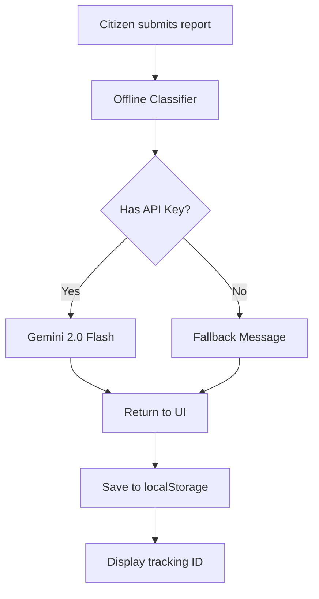
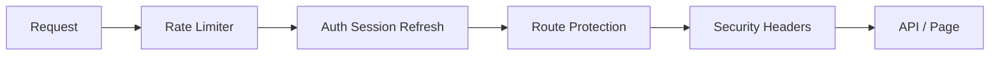

# RescueMind AI — Agent Architecture

> **Skills Applied:** Taste, UI/UX Pro Max, Accessibility, Motion, Micro-interactions, UX Writer, Documentation, Full-Stack Scaffold

---

## 1. Offline Classifier Agent

| Field | Detail |
|-------|--------|
| **Purpose** | Classify citizen reports into 10 PH-specific categories |
| **Model** | `Xenova/paraphrase-multilingual-MiniLM-L12-v2` (384-dim embeddings) |
| **Runtime** | Node.js via Transformers.js — fully offline |
| **Trigger** | Every report submission (always runs first) |
| **Method** | Embedding-based zero-shot classification → cosine similarity |
| **Threshold** | Confidence < 60% → flagged for human review |
| **Fallback** | No internet dependency — always available |

### Categories

| # | Category | Urgency | Office |
|---|----------|---------|--------|
| 1 | Flood / Drainage | High | City Engineering / DPWH |
| 2 | Road Damage | Medium | DPWH / LGU Engineering |
| 3 | Garbage / Waste | Medium | Barangay / CENRO |
| 4 | Noise Complaint | Low | Barangay / PNP |
| 5 | Health / Medical | High | Barangay Health Station / DOH |
| 6 | Permit / License | Low | LGU Mayor's Office / BPLD |
| 7 | Water Supply | High | Barangay / Local Water District |
| 8 | Electricity | High | MERALCO / Local Electric Coop |
| 9 | Public Safety | High | PNP / Barangay Tanod |
| 10 | Others | Medium | Barangay Hall |

---

## 2. Cloud Explanation Agent

| Field | Detail |
|-------|--------|
| **Purpose** | Generate empathetic Tagalog explanation of classification |
| **Model** | Gemini 2.0 Flash (`@google/generative-ai`) |
| **Runtime** | Cloud — requires internet + `GEMINI_API_KEY` |
| **Trigger** | After offline classifier, only when online |
| **Prompt** | See [`PROMPTS.md`](PROMPTS.md) |
| **Timeout** | 10 seconds |

---

## 3. Fallback Agent

| Field | Detail |
|-------|--------|
| **Purpose** | Return static message when Gemini is unreachable |
| **Model** | None — hardcoded Filipino text |
| **Runtime** | Always available |
| **Description** | "Paumanhin, hindi makakuha ng karagdagang paliwanag dahil walang koneksyon sa internet..." |

---

## Data Flow

---

## Middleware Stack

| Layer | Protection |
|-------|-----------|
| Rate Limiter | 30 req/min per IP |
| Auth | Supabase session refresh |
| Routes | `/dashboard` protected, `/api/classify` public |
| Headers | XSS, frame, content-type, referrer, permissions |
