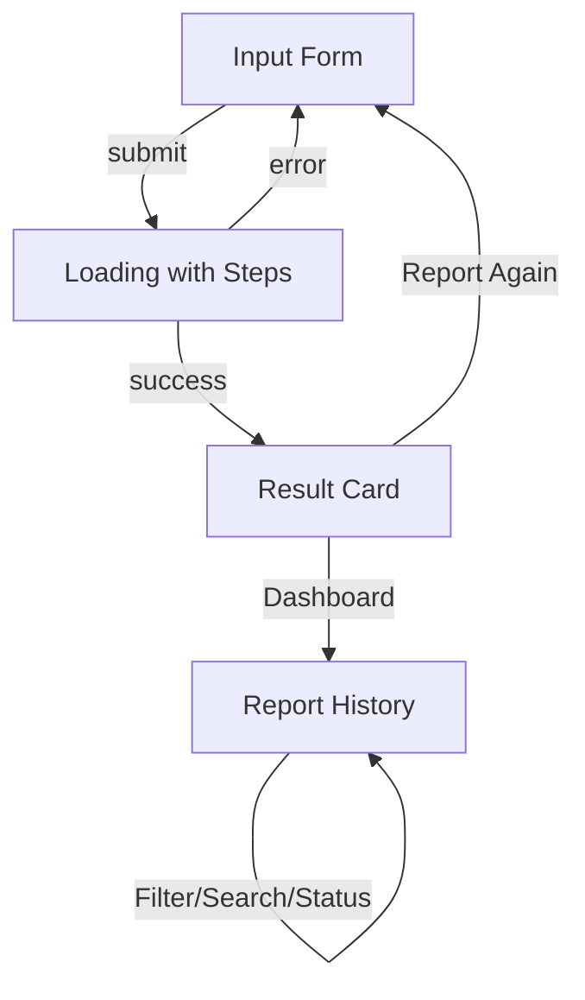

# RescueMind AI — Design Decisions

> **Skills Applied:** Taste (anti-slop design), UI/UX Pro Max, Accessibility (WCAG AA), Motion, Micro-interactions

---

## 1. Design Principles

| Principle | Application |
|-----------|-------------|
| **Typography-first** | Geist variable font across all text; font-size scale based on 4px grid |
| **Color with purpose** | Philippine flag palette (red=urgency, blue=action, white=clarity) |
| **Accessibility-first** | WCAG 2.2 AA contrast ratios, focus-visible, skip link, ARIA labels |
| **Motion with restraint** | Framer Motion for page transitions; no gratuitous animation; respects `prefers-reduced-motion` |
| **Icon integrity** | Phosphor SVG icons inline — no emoji-as-icon, no icon library overhead |
| **Dark mode native** | CSS custom properties + `prefers-color-scheme` + manual toggle |

---

## 2. Color System

| Token | Light | Dark | Usage |
|-------|-------|------|-------|
| `--color-primary` | #2563eb | #3b82f6 | Buttons, links, active states |
| `--color-bg` | #ffffff | #0f172a | Page background |
| `--color-surface` | #ffffff | #1e293b | Card backgrounds |
| `--color-text` | #0f172a | #f1f5f9 | Body text |
| `--color-text-secondary` | #475569 | #94a3b8 | Secondary text |
| `--color-border` | #e2e8f0 | #334155 | Borders, dividers |

### Urgency Colors (inspired by Philippine flag)

| Urgency | Color | Light BG | Dark BG |
|---------|-------|----------|---------|
| High (Urgent) | Red (#b91c1c) | `bg-red-50` | `bg-red-950/30` |
| Medium (Caution) | Yellow (#ca8a04) | `bg-yellow-50` | `bg-yellow-950/30` |
| Low (Safe) | Green (#15803d) | `bg-green-50` | `bg-green-950/30` |

---

## 3. Typography

| Element | Size | Weight | Line Height |
|---------|------|--------|-------------|
| Page title (h1) | 1.5rem / 24px | 700 | 1.2 |
| Card title (h2) | 1.125rem / 18px | 600 | 1.3 |
| Body text | 0.875rem / 14px | 400 | 1.6 |
| Small text | 0.75rem / 12px | 400 | 1.5 |
| Badge | 0.6875rem / 11px | 600 | 1.4 |
| Micro | 0.625rem / 10px | 400 | 1.4 |

Font family: `Geist` (variable, 100–900 weight range)

---

## 4. Component Architecture

### Button System

```tsx
// Base
.btn { padding: 0.625rem 1.25rem; border-radius: 0.75rem; transition: all 150ms; }

// Variants
.btn-primary   → background: --color-primary; color: white
.btn-secondary → background: --color-bg-secondary; border: 1px solid --color-border
.btn-ghost     → background: transparent; color: --color-text-secondary
.btn-danger    → background: --color-danger; color: white
```

### Card Component

```tsx
.card {
  background: --color-surface;
  border: 1px solid --color-border;
  border-radius: 1rem;
  box-shadow: 0 1px 2px 0 rgb(0 0 0 / 0.04);
  transition: box-shadow 200ms, border-color 200ms;
}
.card:hover {
  box-shadow: 0 4px 6px -1px rgb(0 0 0 / 0.06);
  border-color: --color-border-hover;
}
```

### Skeleton Loader

```css
.skeleton {
  background: linear-gradient(90deg, --color-bg-muted 25%, --color-bg-secondary 37%, --color-bg-muted 63%);
  background-size: 200% 100%;
  animation: shimmer 1.5s ease-in-out infinite;
}
```

---

## 5. Screen Flow



### Screen States

| Screen | States | Transitions |
|--------|--------|-------------|
| Input | Form, validation error, location detecting | fade-up (Framer Motion) |
| Loading | Steps 1→2→3, complete | scale-in |
| Result | Tracking, urgency badge, explanation, disclaimer | slide-up, staggered |
| Dashboard | List, empty, filtered, searching | fade-up, staggered |
| Auth | Login, signup, success, error | fade-up |

---

## 6. Accessibility Features

| Feature | Implementation |
|---------|---------------|
| Skip link | `#main-content` skip anchor, focus-revealed |
| Focus visible | `:focus-visible` outline with primary color |
| ARIA labels | All interactive elements have descriptive labels |
| Screen reader | `sr-only` utility for supplementary text |
| Role attributes | `navigation`, `main`, `contentinfo`, `alert`, `status` |
| Color contrast | WCAG 2.2 AA (4.5:1 for text, 3:1 for large text) |
| Reduced motion | `prefers-reduced-motion` media query disables all animations |
| Form validation | `aria-invalid`, `aria-describedby`, `role="alert"` |
| Keyboard nav | All functions accessible via keyboard |

---

## 7. Technology Decisions

### Why Geist Font?
- Variable font (single file for all weights)
- Designed for screens (high legibility at small sizes)
- MIT license, free

### Why Inline SVG Icons Instead of @phosphor-icons/react?
- Zero runtime dependency for icons
- Tree-shake at compile time (only used icons included)
- Dark mode color inheritance via `currentColor`

### Why Framer Motion Instead of CSS Animations?
- Orchestration (stagger, delays, AnimatePresence)
- Declarative API co-located with components
- Respect for `prefers-reduced-motion` built-in
- 12.40 is stable and lightweight (10KB gzip)

### Why CSS Variables + Tailwind Instead of CSS-in-JS?
- Runtime performance (no JS parsing for styles)
- Dark mode via `class` strategy + `var()` tokens
- Smaller bundle than emotion/styled-components
- Tailwind's JIT ensures zero unused styles
