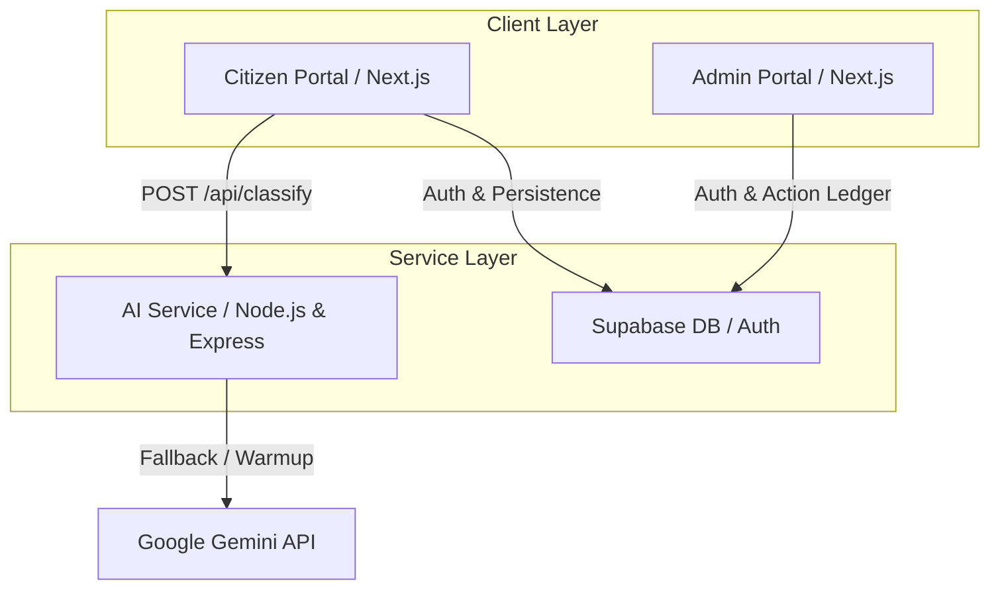

# 🇵🇭 RescueMind AI

### Enterprise-Grade Barangay Disaster & Complaint Triage System

RescueMind AI is a modern, production-ready, **offline-first**, and multi-dialect bilingual AI system designed specifically for Philippine local government units (LGUs/Barangays). It classifies citizen reports, assigns urgency levels, routes incidents to correct government offices, and provides a secure, traceable management ledger for local officials.

> [!IMPORTANT]
> **Live Demo Deployments:**
> All services are fully deployed and operational for the live demonstration:
> - **AI Service:** Deployed on **Render** (Singapore Region)
> - **Citizen Portal (Frontend):** Deployed on **Vercel**
> - **Admin Portal:** Deployed on **Vercel**

---

## 🏗️ Monorepo Architecture

This repository is organized as a monorepo containing three distinct, decoupled sub-applications designed to scale independently:



### Decoupled Sub-Applications

1. **`Capstone/app/frontend` (Citizen Portal)**
   - **Framework:** Next.js 15 (App Router), React 19, Tailwind CSS.
   - **Role:** Public interface where residents submit incident reports with optional geolocation detection, select locations using the Philippine Standard Geographic Code (PSGC) database, and track report status.
   - **Deployment:** Vercel (Independent Serverless App).

2. **`Capstone/app/admin` (Barangay Admin Portal)**
   - **Framework:** Next.js 15 (App Router), React 19, Tailwind CSS.
   - **Role:** Private dashboard for Barangay officials to review active incident logs, override AI classifications, update status (Pending, In Progress, Resolved), and append internal resolution notes.
   - **Deployment:** Vercel (Independent Serverless App).

3. **`Capstone/app/ai-service` (AI Classification Engine)**
   - **Framework:** Node.js, Express, HuggingFace `Transformers.js` (`Xenova/paraphrase-multilingual-MiniLM-L12-v2`).
   - **Role:** High-performance, low-latency microservice that performs offline-first vector embedding matching to categorize text in Tagalog/English and compute urgency levels, falling back to Gemini for cloud enrichment.
   - **Deployment:** Render Web Service (Singapore region, Node 20).

---

## ⚡ Key Features & Portals

### 🖥️ Citizen Portal (Frontend Dashboard)
*   **Dynamic Complaint/Disaster Intake:** Single-card form for writing reports in plain text.
*   **Bilingual & Dialect Switching:** Switch UI instantly between English, Tagalog (Filipino), Cebuano (Bisaya), and Ilocano (Amihanang Luzon) on the landing page and report forms.
*   **One-Click Geolocation:** Automatically queries browser GPS coordinates and reverse-maps them to region/province labels using the local database.
*   **Offline-First Safety Ledger:** Falls back to local classification, localStorage queues, and caches report history when the internet connection is disrupted.
*   **Real-time Ledger Tracking:** Residents can monitor status (Pending, In Progress, Resolved) and look up reports using custom tracking codes (`RM-YYYYMMDD-XXXX`).

### 🛠️ Barangay Admin Portal
*   **Secure Authentication:** Controlled email/password dashboard access powered by Supabase Auth and Row Level Security (RLS) tables.
*   **Operational Workflow Controls:** Shift active items along the standard state pipeline: `Pending` ➡️ `In Progress` ➡️ `Resolved`.
*   **Audit Resolution Notes:** Log internal resolution steps or dispatch notes directly into the database associated with specific reports.
*   **Human Review & Overrides:** Dedicated review flags for low confidence classifications (< 60%), allowing officials to override routing and category choices.
*   **CSV/JSON Data Export:** Export the complete active incident ledger to Excel/JSON formats for municipal reporting.

### 🧠 Core System Capabilities
*   **Dual-Tier AI Engine:** Fast offline similarity matching (Transformers.js paraphrase-multilingual-MiniLM model) with optional Cloud Enrichment (Google Gemini 2.0 Flash) for dialect reasons and office-routing logic.
*   **Integrated PSGC Dataset:** All 17 regions and 82 provinces embedded locally for manual location drop-downs.
*   **Production Guardrails:** Edge-routing compatibility, rate limiting (30 requests/minute), and dark-mode options.

---

## 🔄 End-to-End Workflow Lifecycle

1. **Intake:** Resident submits report text (e.g. *"Baha sa kalsada"* or *"Strong floods near school"*) on the Citizen Portal, with optional GPS/PSGC location tracking.
2. **AI Classification:** The intake request hits `rescuemind-ai-service` on Render, extracting the category (e.g., `Flood`), routing department (e.g., `DPWH`), urgency (`high`), and confidence score.
3. **Reasoning & Translations:** If online, Gemini is invoked to write a translation and explanation in the target dialect.
4. **Validation:** If the score is below 60%, the system flags the report as `needs_human_review`.
5. **Persistence:** The classified report is pushed to Supabase and client-side state.
6. **LGU Action:** Officials view the incident ledger on the Admin Portal, assign status, and write internal notes.
7. **Resolution:** Ledger transitions to `Resolved`, notifying the resident checking the portal.

---

## 🚀 Deployment Strategy

### 1. AI Service (Render Deployment)
The classification service runs on Render to sustain server execution and cache the HuggingFace weights locally.

*   **Render Blueprint (`render.yaml`):** The repository includes a `render.yaml` file in the root directory. To deploy:
    1. Log in to [Render](https://dashboard.render.com).
    2. Click **New +** → **Blueprint**.
    3. Connect this GitHub repository.
    4. Render will automatically detect the configuration and build the `rescuemind-ai-service` pointing to `Capstone/app/ai-service`.
*   **Critical Health Check Settings:**
    *   `healthCheckPath: /api/health`
    *   Configure **Initial Delay** to `120` seconds and **Timeout** to `60` seconds on the Render Dashboard to give the HuggingFace model sufficient time to download on first spin-up.
*   **Post-deploy Warmup:** Call a `POST` request to `/api/warmup` to download and cache the embedding model pre-emptively so the first classification request returns immediately.

### 2. Frontend & Admin Portals (Vercel Deployment)
The frontend and admin portals are deployed independently as Next.js projects on Vercel.

*   **Citizen Portal Setup (`Capstone/app/frontend`):**
    *   Framework Preset: **Next.js**
    *   Root Directory: `Capstone/app/frontend`
    *   Environment Variables:
        *   `NEXT_PUBLIC_SUPABASE_URL`: Your Supabase Project URL.
        *   `NEXT_PUBLIC_SUPABASE_ANON_KEY`: Your Supabase Anon Key.
        *   `GEMINI_API_KEY`: Google Gemini Key for cloud AI translation and reasoning.
        *   `NEXT_PUBLIC_AI_SERVICE_URL`: Endpoint of the Render service (`https://rescuemind-ai-service.onrender.com`).
*   **Barangay Admin Portal Setup (`Capstone/app/admin`):**
    *   Framework Preset: **Next.js**
    *   Root Directory: `Capstone/app/admin`
    *   Environment Variables:
        *   `NEXT_PUBLIC_SUPABASE_URL`: Your Supabase Project URL.
        *   `NEXT_PUBLIC_SUPABASE_ANON_KEY`: Your Supabase Anon Key.

---

## 💻 Local Development

1. **Clone the Repository:**
   ```bash
   git clone https://github.com/your-username/rescuemind.git
   cd rescuemind
   ```

2. **Install Monorepo Dependencies:**
   ```bash
   cd Capstone/app
   pnpm install
   ```

3. **Configure Environment Variables:**
   Create `.env.local` files inside `Capstone/app/frontend` and `Capstone/app/admin` referencing their respective required configurations.

4. **Run in Development Mode:**
   ```bash
   # From Capstone/app/
   pnpm dev
   ```

---

## 🛡️ Database & Security Schema

The project includes pre-configured **Row Level Security (RLS)** scripts inside `/supabase/schema.sql` to restrict access controls:
- **`reports` table:** Public write access (`INSERT`) for anonymous submissions, but read (`SELECT`) and write (`UPDATE`, `DELETE`) operations are strictly limited to authenticated Barangay admin roles.
- **Rate Limiting:** Next.js middleware blocks suspicious traffic and restricts API execution to prevent service abuse.

---

## 📄 License & Standards
Developed under modern WCAG 2.2 AA accessibility guidelines and complies with Philippine government open-data sharing protocols. 
All assets and custom logos are properties of **RescueMind AI © 2026**.
